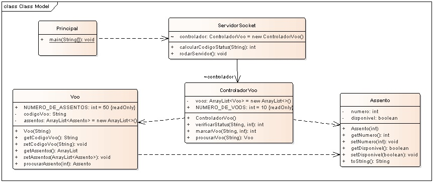

# Aplicação Servidor do Sistema de Controle de Passagem usando Java Socket.

## Contextualização

Sistema de Controle de Passagem realiza a consulta e marcação de voo e assento usando Java Sockets.
O programa servidor controla e mantêm os voos e assentos. 
O programa cliente realiza consultas e marcações se comunicando com o servidor.
Entre o cliente e o servidor existe um protocolo de comunicação.
- Use o repositório "socket_controle_passagem_cliente" como o programa cliente.

### Consulta Voo

Para o programa cliente consultar é necessário especificar um protocolo de comunicação com o servidor.

O texto do protocolo de consultta será pré-fixado com "C".

Na consulta o programa cliente especifica um voo e assento para saber se estão disponíveis. 

O programa servidor retorna:
 - 0: voo disponível
 - 1: assento indisponível
 - 2: assento inexistente
 - 3: voo inexistente
 - 4: marcação realizada

Um exemplo de consulta ao servidor com o texto:
 - **"C;A1;1"**

A string é separada por ponto e vírgula, onde o protocolo de comunicação é de consulta "C" do código de voo "A1" e assento "1".

### Marcação Voo

A marcação envolve mandar o código do voo e assento ao servidor e este marcar como indisponível. 

O programa servidor retorna:
 - 0: voo disponível
 - 1: assento indisponível
 - 2: assento inexistente
 - 3: voo inexistente
 - 4: marcação realizada

O texto do protocolo de marcação é pré-fixado com "M".

Um exemplo de marcação de voo ao servidor com o texto:
- **"M;A1;1"**

Uma string separada por ponto e vírgula, onde a comunicação é de marcação "M" do código de voo "A1" e assento "1".

## Diagrama de classes

## Arquivos

- pom.xml - Arquivo de configuração da ferramenta de automação Maven.
- *.bat - Arquivos de lote(Batch) de console para tarefas compilar, executar, documentar, empacotar e limpar o projeto.